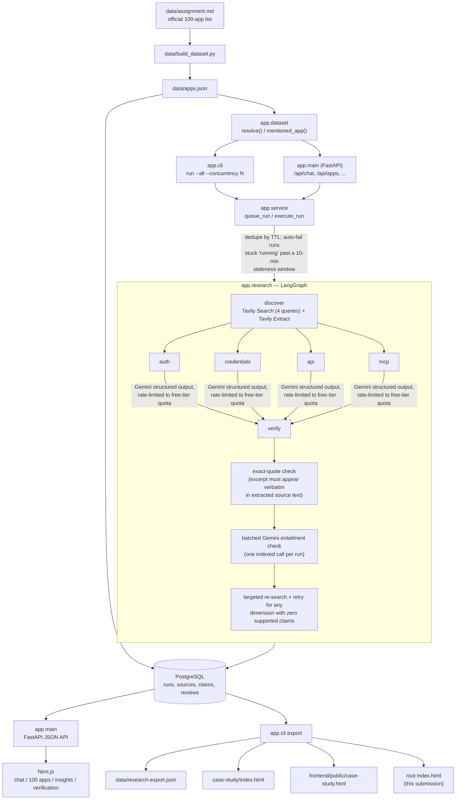

# Fieldnote — Integration Researcher

A focused research application for the **exact 100 apps in the Composio AI Product Ops take-home assignment**. The primary reviewer artifact is [index.html](index.html), a standalone case study generated from the stored dataset and research results. The app adds a context-locked chat, the 100-app matrix, computed insights, and a verification ledger.

## Current evidence state

The official assignment list is loaded: **100 apps in 10 categories**. All **100 apps have completed research runs** against live Tavily and Gemini services. A 22-claim human audit sample (at least one app per category, plus every app that verified as `Blocked`) was cross-checked by hand against the original source pages: **16 correct, 2 incorrect, 4 uncertain**, for **88.9% audited accuracy**. Of 1,233 claims the agent drafted across all 100 apps, the automatic exact-quote + entailment verification loop withheld 44% (387 unsupported, 144 uncertain, 2 contradicted) before they ever reached the dossier — see the Verification page for the full ledger, including the specific misses the human audit caught (e.g. one Stripe claim that inverted a conference anecdote's meaning, one Ramp claim that could not be re-confirmed on re-fetch).

## Architecture



Tavily handles retrieval; `gemini-3.5-flash-lite` reasons over extracted text using Pydantic structured output (paced under its free-tier 15 requests/minute cap — see `GEMINI_REQUEST_INTERVAL_SECONDS` in `config.py`). The four research dimensions run in parallel. A claim must cite an extracted URL, contain an exact source excerpt, and pass an independent Gemini entailment check before appearing as a fact. Unsupported, contradicted, and uncertain claims remain in the verification ledger rather than being discarded. A buildability verdict is derived conservatively from supported access, auth, and API claims. On top of the automatic loop, a human audit (`POST /api/reviews`) cross-checks a sample against the live source pages and records a correct/incorrect/uncertain verdict per claim — see `data/research-export.json` and the Verification page for the resulting accuracy numbers.

The official dataset lives in `data/assignment.md`. `data/build_dataset.py` parses it into `data/apps.json`; no alternate app list is used. Hints are discovery seeds, not verified evidence. The full requirements, schema and workflow are in [docs/PLAN.md](docs/PLAN.md).

Implementation references: [Tavily Search and Extract API](https://docs.tavily.com/documentation/api-reference/introduction), [Google Gen AI Python SDK structured output](https://googleapis.github.io/python-genai/), and [LangGraph parallel graph execution](https://docs.langchain.com/oss/python/langgraph/use-graph-api).

## Stack

- Next.js / React frontend
- FastAPI and Pydantic backend
- LangGraph orchestration
- Gemini (`gemini-3.5-flash-lite` by default; `GEMINI_MODEL` is configurable)
- Tavily Search and Extract
- PostgreSQL via SQLAlchemy; local SQLite fallback for basic UI inspection and tests

## Setup

Use Python 3.11+ and Node 20+.

```bash
cp .env.example .env
# Set TAVILY_API_KEY and GEMINI_API_KEY in .env
docker compose up -d postgres
python3 -m venv .venv
.venv/bin/pip install -r backend/requirements.txt
cd frontend && npm install && cd ..
```

`DATABASE_URL` in `.env.example` targets the Docker PostgreSQL service. Remove it for a local SQLite-only UI demonstration. Never put API keys in `NEXT_PUBLIC_` variables.

For a deployed frontend, copy `frontend/.env.local.example` to `frontend/.env.local` and set `NEXT_PUBLIC_API_URL` to the deployed FastAPI origin. Set `FRONTEND_ORIGIN` on the backend to the frontend origin for CORS.

## Run

Terminal 1:

```bash
cd backend
../.venv/bin/uvicorn app.main:app --reload --port 8000
```

The API creates tables and loads the 100-app dataset on startup. Terminal 2:

```bash
cd frontend
npm run dev
```

Open `http://localhost:3000`. Click an application or ask “Tell me about Salesforce.” Follow-ups retain the active app in the session. Out-of-scope questions are refused. `GET /api/health` reports whether live research keys are available.

## Batch research and reproduction

```bash
cd backend
../.venv/bin/python -m app.cli run --app Salesforce
../.venv/bin/python -m app.cli run --all --concurrency 3
../.venv/bin/python -m app.cli export
```

The batch runner reuses a completed run for seven days. Add `--refresh` to force new research. The export writes `data/research-export.json`, `case-study/index.html`, root `index.html`, and `frontend/public/case-study.html` from the same stored records. The HTML can be deployed as a static file. It does not need the app to be running.

For a limited run: `--all --limit 5`. Start with Salesforce and inspect the retrieved URLs and exact quotes before processing all 100. Tavily and Gemini usage will depend on their account limits.

## Verification and human audit

1. The extraction URL must match one returned by Tavily Extract.
2. The quote must occur in that source's extracted content.
3. A separate Gemini check rates entailment as supported, unsupported, contradicted or uncertain.
4. Only supported claims appear in the main dossier and aggregate counts.
5. A human opens original URLs for a sample and records correct, incorrect, or uncertain decisions through `POST /api/reviews` with a claim ID and note.

The Verification page separates automatic outcomes from human reviews. It intentionally does not display a human accuracy percentage or improvement before a sample has actually been audited. The CLI export retains rejected claims and reasons for the case study. Recommended sample: at least one app per category plus each gated or ambiguous case; review auth, access, API, MCP, and the resulting verdict. Record source changes or inaccessible pages as uncertain.

## Tests

```bash
cd backend
../.venv/bin/python -m pytest -q
cd ../frontend
npm run build
```

The backend tests cover the exact dataset, resolver, context switching, scope restriction, quote checks, conservative buildability, and a mocked full LangGraph fan-out/fan-in run. They do not pretend to test live Tavily or Gemini without credentials.

## Known limits

- No paid or partner app accounts were supplied. Gated access may remain uncertain after public-doc research.
- Tavily extraction can miss dynamic or protected documentation; the app reports gaps.
- An exact quote plus model entailment reduces unsupported claims but is not a substitute for a human sample audit.
- A completed run can include fewer dimensions if documentation is missing. “No supported finding” does not mean the feature is absent.
- A research job runs in the FastAPI process. For production load, move jobs to a durable queue; the take-home keeps infrastructure small.
- Gemini's free tier caps request throughput (this project uses `gemini-3.5-flash-lite`, paced under its 15 requests/minute limit); a paid tier would remove this constraint and speed up re-runs.

## Repository map

| Path | Purpose |
| --- | --- |
| `index.html` | Standalone reviewer case study |
| `data/assignment.md`, `data/apps.json` | Official task and exact research set |
| `backend/app/research.py` | Tavily, Gemini, LangGraph, verification |
| `backend/app/db.py`, `service.py` | Storage, caching, aggregates |
| `backend/app/main.py`, `cli.py` | API, batch runner and export |
| `frontend/app/` | Chat and analysis pages |
| `docs/PLAN.md` | Requirements, schema and implementation plan |

## Screenshots

The case study contains an explicitly labeled interface illustration. A real app screenshot can be added after running the app locally or deploying it with research credentials.
